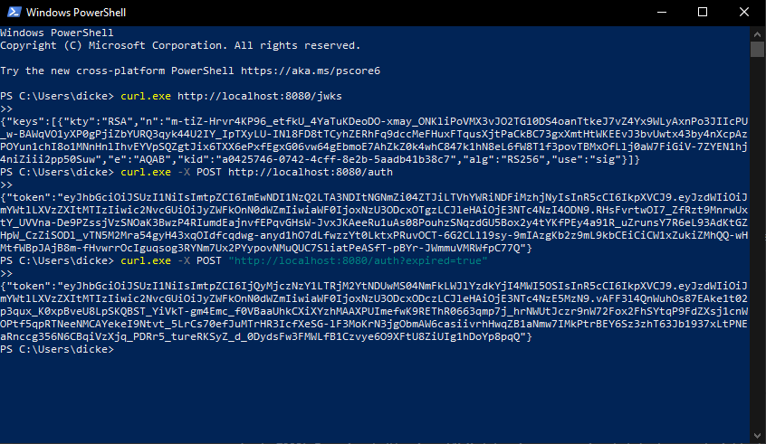
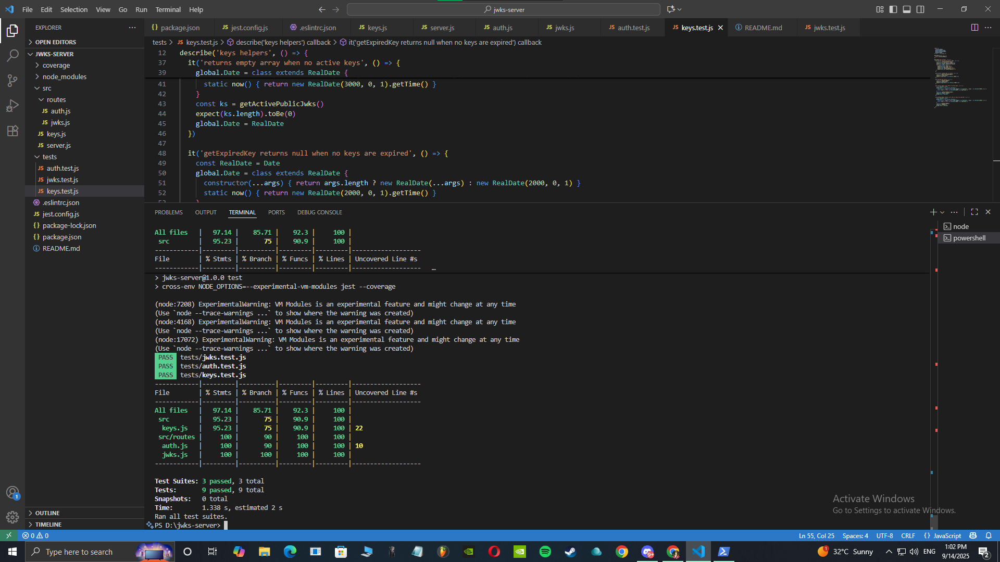

# JWKS Server by Taras Glushko
A simple JSON Web Key Set (JWKS) and JWT authentication server for educational testing.

- `/jwks`: JWKS of non-expired keys
- `/auth` (POST): JWT with `kid`
- `/auth?expired=true`: JWT signed with an expired key and past `exp`

## Environment
- Node.js version: 22.19.0
- npm version: 10.9.3
- Framework: Express.js
- Dependencies:
  - jose (for JWT)
  - express
  - cross-env
  - jest
  - supertest
## Installation
- To install dependencies:
  - npm install
## Testing
- To run tests:
  - npm test

## Run
- npm i
- npm start

## Deliverables

### Test Client Output

### Test Coverage

