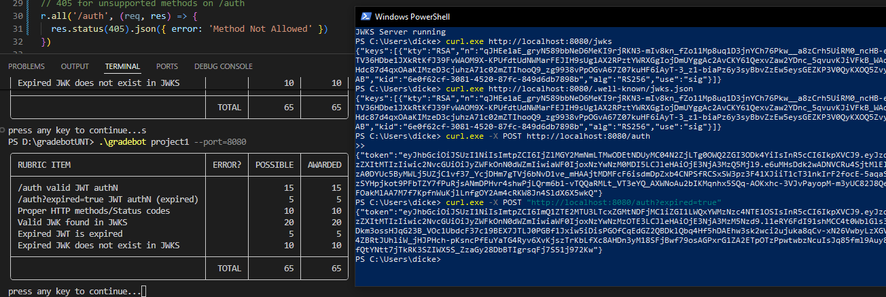
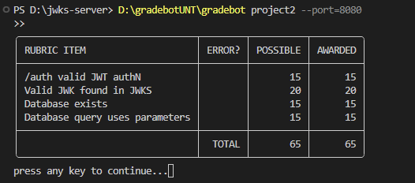
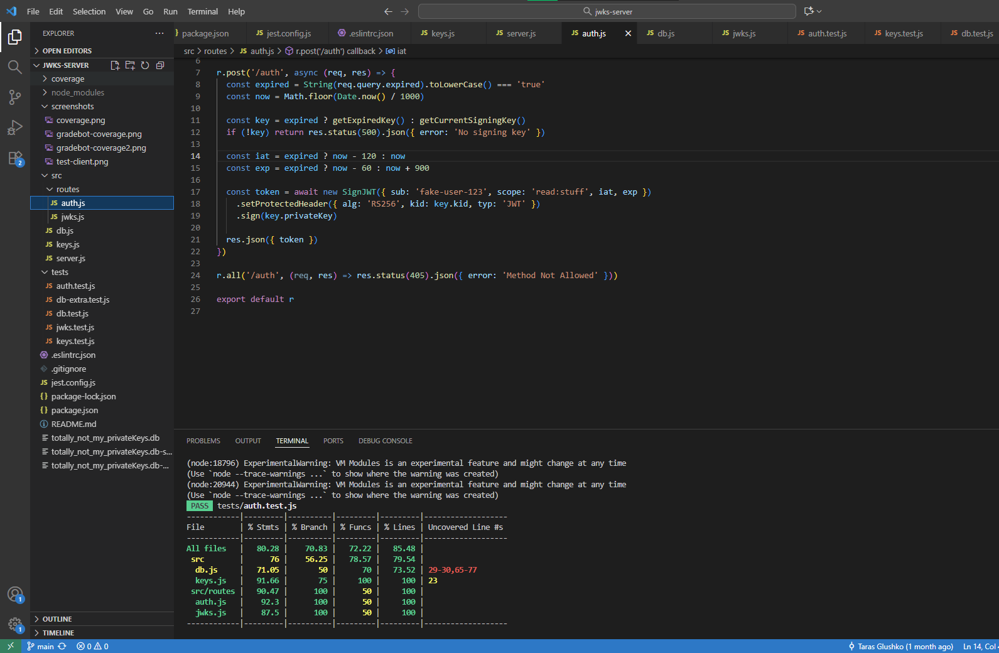

# JWKS Server by Taras Glushko
A simple JSON Web Key Set (JWKS) and JWT authentication server built for educational testing and extended with SQLite database integration.

---

## 🧩 Endpoints

- **`/jwks`** → Returns the JWKS (JSON Web Key Set) containing all **non-expired public keys**.
- **`/auth` (POST)** → Returns a JWT signed with a valid (unexpired) key, including its `kid`.
- **`/auth?expired=true`** → Returns a JWT signed with an **expired key** and a past expiration timestamp (`exp`).

---

## ⚙️ Environment

| Component | Version / Details |
|------------|------------------|
| **Language** | JavaScript (Node.js) |
| **Node.js Version** | 22.19.0 |
| **npm Version** | 10.9.3 |
| **Framework** | Express.js |
| **Database (Project 2)** | SQLite (via `sqlite3` package) |
| **JWT Library** | `jose` |
| **Testing Frameworks** | Jest, Supertest |
| **OS (Tested)** | Windows 11 Pro (Build 22631) |
| **IDE** | Visual Studio Code |
| **Port Used** | 8080 |

---

## 🧰 Installation & Configuration

Clone the repository and install all required packages:

- git clone https://github.com/Ivan1337-prg/jwks-server.git
- cd jwks-server
- npm install
- npm start (http://localhost:8080 -> should see 'JWKS server is running')

## Deliverables

### Test Client Output

### Gradebot Client 

**Project 1**
- D:\gradebotUNT\gradebot project1 --port=8080
  

**Project 2**
- D:\gradebotUNT\gradebot project2 --port=8080
  

### Test Coverage

